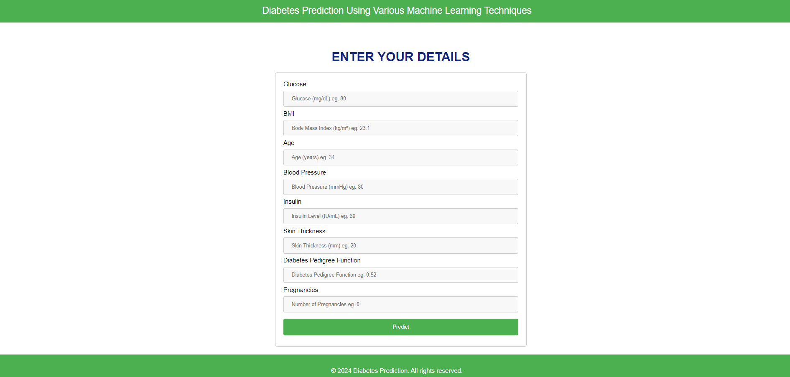
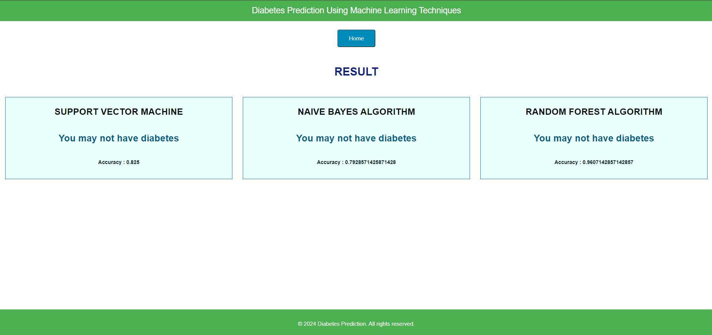
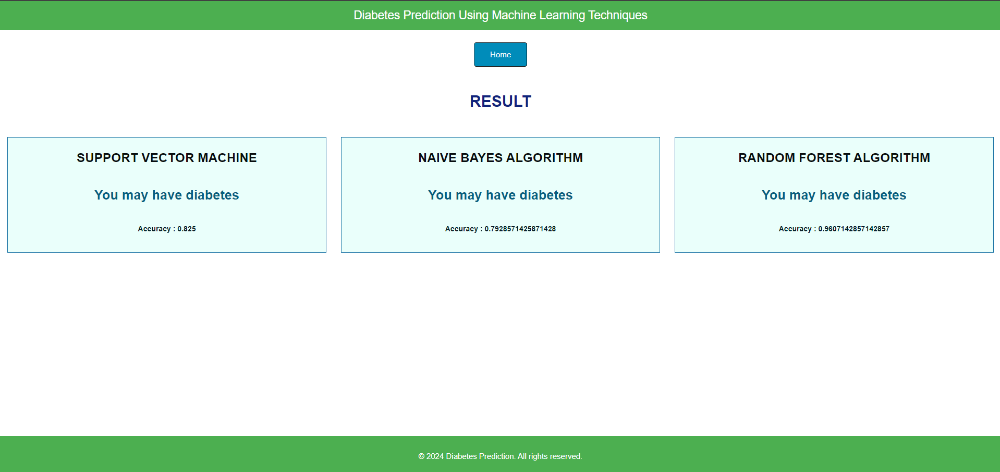
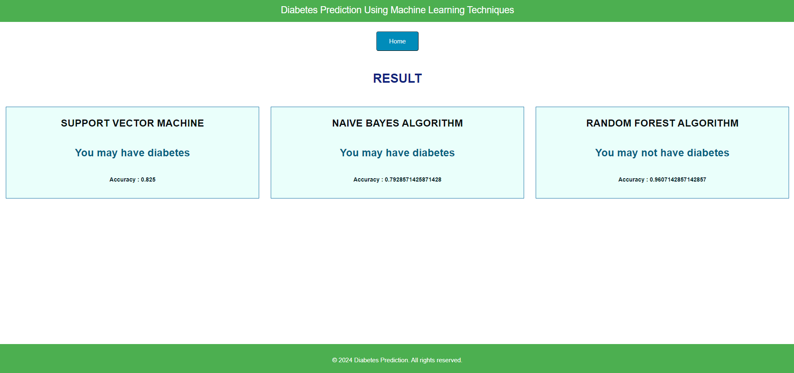
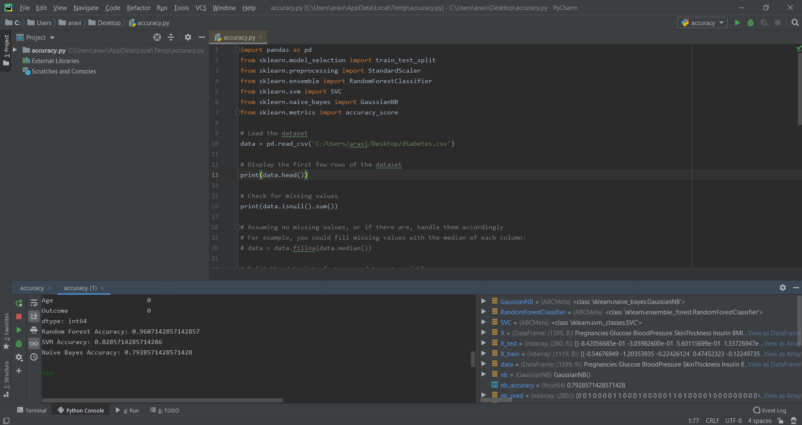

🩺 Diabetes Prediction Using Machine Learning Techniques

## Overview

This project aims to predict the likelihood of diabetes in patients using various machine learning techniques. 
By leveraging algorithms such as Support Vector Machine, Naive Bayes, and Random Forest, the system can provide accurate predictions and assist in early diagnosis and treatment planning.

## Project Description

### Techniques Used

- Support Vector Machine (SVM): A supervised learning algorithm that can classify cases by finding a decision boundary.
- Naive Bayes (NB): A probabilistic classifier based on Bayes' theorem with strong independence assumptions between the features.
- Random Forest (RF): An ensemble learning method that operates by constructing multiple decision trees during training and outputting the mode of the classes.
 
### Features

- Prediction Accuracy: Compares the accuracy of different machine learning algorithms.
- User-Friendly Interface: Provides an intuitive interface for users to input data and get predictions.
- Result Display: Shows positive or negative results based on the prediction model.

## Screenshots

### Prediction Page

### Positive Result

### Negative Result

### Based on Accuracy

## Accuracy Comparison

The project evaluates the performance of each machine learning model based on accuracy.

## Installation

Follow these steps to set up the project on your local machine.

Note : **Python 3.7.5**

## Step 1: Clone the repository

First, clone the repository to your local machine.

## Step 2: Install the required libraries

Install the necessary libraries using pip:

**pip install Django**

**pip install pandas**

**pip install scikit-learn**

## Step 3: Start the development server

Run the following command to start the Django development server:

**python manage.py runserver**

## Step 4: Access the application

Open your web browser and go to: **http://127.0.0.1:8000/**

You should see the home page of the Diabetes Prediction application.

## Contributing

Contributions are welcome! Please feel free to submit issues, fork the repository, and send pull requests.

---

Thank you for your interest in the Diabetes Prediction project. Together, we can make a difference in early diabetes detection and management.
